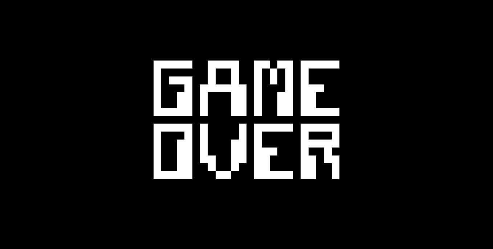

# CHIP-8 emulator

<p>An emulator of CHIP-8, written in C++.</p>
<p>"CHIP-8 is an interpreted programming language, developed by Joseph Weisbecker. It was initially used on the COSMAC VIP and Telmac 1800 8-bit microcomputers in the mid-1970s. CHIP-8 programs are run on a CHIP-8 virtual machine. It was made to allow video games to be more easily programmed for these computers, but CHIP 8 is still used today, due to its simplicity, and consequently on any platform and its teaching of programming Binary numbers."</p>
<p><a href="https://en.wikipedia.org/wiki/CHIP-8" target="_blank">Wikipedia about CHIP-8</a></p>

# About the project
<p>The project was built with this <a href="http://devernay.free.fr/hacks/chip8/C8TECH10.HTM" target="_blank">documentation</a>.
This documentation it's required for build the cpu, inputs and outputs of CHIP-8.</p>
<p>The language chosen it's C++, there are plans to use this solution in a microcontroller, so
the language can help to speed up future development, where i'll just need to rewrite a few things.</p>

## Graphics

<p>To render graphics of the emulator, <a href="" target="_blank">OpenGL</a> is used.</p>

## Sound
<p>Not yet developed.</p>

# Getting Started

## Running
```
chip8 [Path to file with code]
```
